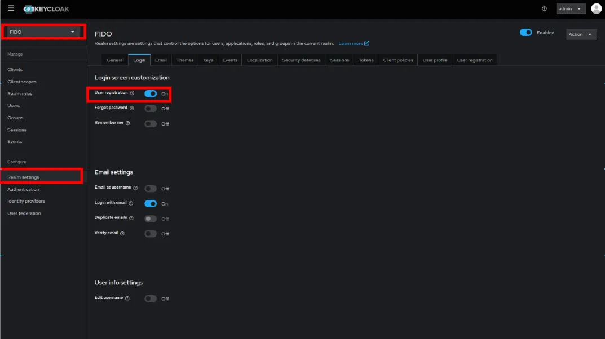
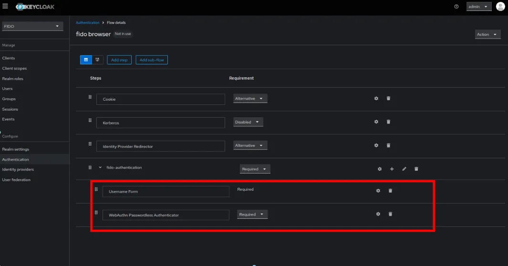
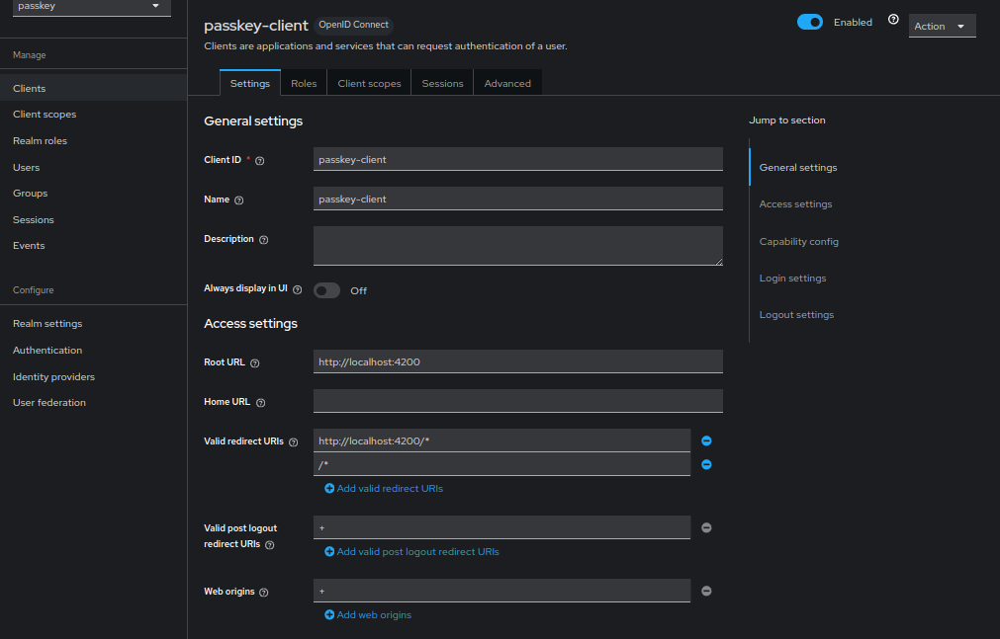
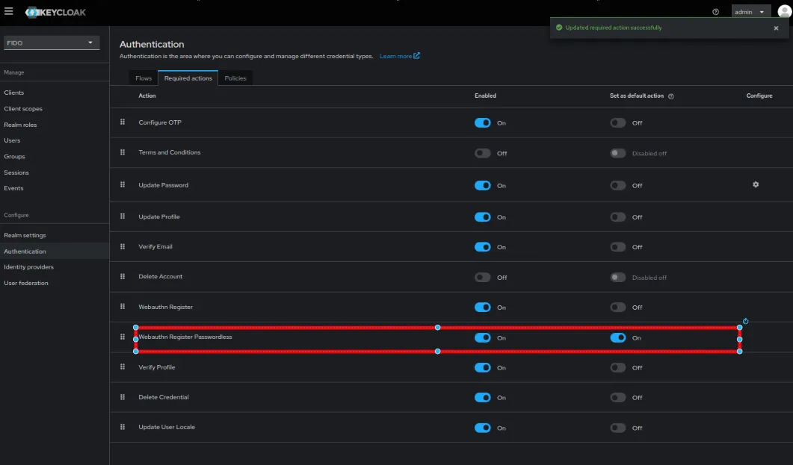
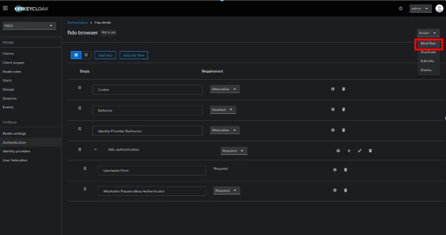

# Keycloak Passkey Authentication Configuration Guide

This guide outlines the process of configuring Keycloak to support FIDO2 Passkey authentication, enabling passwordless login for your applications.

## Prerequisites

- A running Keycloak instance
- Administrative access to Keycloak
- Basic understanding of authentication flows

## Configuration Steps

### 1. Enable User Registration

Enable self-registration in your realm settings to allow users to register their passkeys.

### 2. Configure Authentication Flow

#### 2.1 Create New Browser Flow

1. Navigate to `Authentication` in the left panel
2. Select the `Flows` tab
3. Locate the `browser` flow and click `Duplicate`
4. Name the new flow `fido-browser`

#### 2.2 Configure Authentication Steps

1. Remove all existing authentication steps under the `fido-browser forms`
2. Create a new subflow with the following components:
   - Username Form
   - WebAuthn Authentication

### 3. Client Configuration

The passkey client is automatically created during docker-compose deployment. However, if you need to create a new client:

1. Navigate to `Clients` in the left panel
2. Click `Create`
3. Configure the client settings according to your requirements

### 4. WebAuthn Configuration

Configure WebAuthn settings for passwordless registration:

- Set up signature algorithms
- Configure attestation conveyance preferences
- Define authenticator attachment preferences
- Set required resident key parameters

### 5. Bind Authentication Flow

Assign the newly created authentication flow as the default browser flow:

1. Navigate to Authentication settings
2. Select `Bindings` tab
3. Set `Browser Flow` to your new `fido-browser` flow

## User Registration Process

When users authenticate for the first time:

1. They encounter the registration interface
2. A FIDO2-compliant credential creation dialog appears
3. The system generates a cryptographic key pair
4. The private key is stored securely in the device's trusted execution environment
5. The public key is transmitted to the server for future authentication

## Security Features

- Keys are stored in the device's trusted execution environment or hardware security module
- Automatic synchronization across authenticated devices
- Compliance with FIDO2 standards
- Passwordless authentication reduces phishing risks

## Testing and Verification

After configuration, test the authentication flow by:

1. Accessing your application
2. Following the passkey registration process
3. Verifying successful authentication
4. Testing cross-device authentication if applicable

## Conclusion

This configuration establishes a secure, passwordless authentication system using FIDO2 passkeys in Keycloak. The implementation provides:

- Enhanced security through cryptographic keys
- Improved user experience with passwordless login
- Cross-device compatibility
- FIDO2 standard compliance

For additional configuration options or troubleshooting, refer to the official Keycloak documentation.